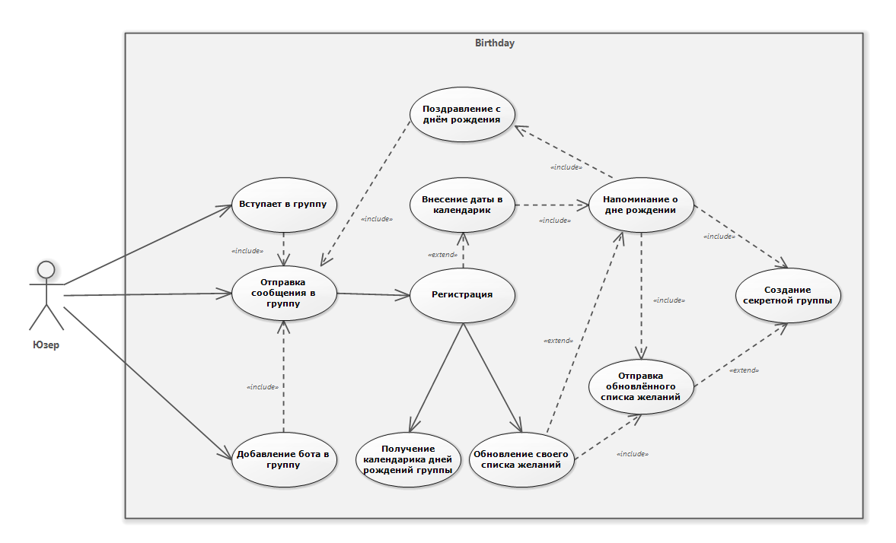
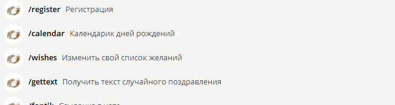
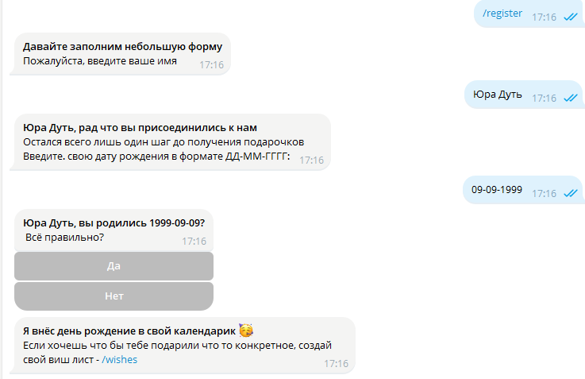

## 

## 

## 

**«Фантик» - Умный календарь дней рождений**

**Автор**

Соловьев Иван Андреевич

**Дата создания**

15.01.2024

**Версия**

Ver 0.5 beta

**Описание проекта**

Телеграмм бот для учёта дней рождений. Он учитывает каждую беседу и индивидуален для каждого

**Содержание**

[Введение](#_Toc157179418)

[Цель проекта](#_Toc157179419)

[Основные функциональности](#_Toc157179420)

[Технологии и инструменты](#_Toc157179421)

[Диаграмма использования](#диаграмма-использования)

[Структура проекта](#_Toc157179423)

[Хендлеры](#хендлеры)

[Введение](#введение)

[Методы](#методы)

[Менеджер Базы Данных](#менеджер-базы-данных)

[Введение](#введение-1)

[Инициализация](#инициализация)

[Методы](#методы-1)

[APScheduler](#apscheduler)

[Введение](#введение-2)

[Методы](#методы-2)

**Введение**

Современные условия работы предполагают не только эффективное управление бизнес-процессами, но и заботу о комфорте сотрудников. Телеграм Бот "Birthday Tracker" создан с целью улучшения рабочей атмосферы в компании, обеспечивая учет и своевременное напоминание о днях рождения сотрудников.

**Цель проекта**

Целью проекта является разработка инструмента для автоматизированного учета и отслеживания дней рождений сотрудников компании, предоставляя функциональность, адаптированную под использование в мессенджере Telegram.

**Основные функциональности**

-   Регистрация сотрудников с указанием даты рождения.
-   Автоматическое напоминание о предстоящих днях рождения в чате или личных сообщениях.
-   Возможность просмотра календаря дней рождений среди сотрудников.

**Технологии и инструменты**

**Язык программирования**

-   Python

    **База данных**

-   PostgreSQL

    **Фреймворки:**

-   Pyrogram
-   Aiogram
-   Psycopg2
-   Apscheduler

## Диаграмма использования

Современные информационные технологии становятся важным элементом в повседневной жизни и бизнес-процессах. В данном контексте создание и внедрение программных решений становится ключевым аспектом успешной организации.

Use-Case диаграмма для Telegram Бота "Фантик" представляет собой визуализацию функциональных требований к системе, фокусируясь на взаимодействии между актерами (пользователями) и системой. Этот графический инструмент позволяет наглядно представить различные сценарии использования, выделяя ключевые функциональности, которые обеспечивают комфорт и эффективность пользовательского опыта.

Use-Case диаграмма Telegram Бота "Фантик" выделяет следующие ключевые сценарии использования:

**Добавление в группу:**

Актёр «Юзер» может добавить бота в группу, после чего будет отправлено приветственное сообщение с просьбой пройти регистрацию

**Регистрация дня рождения:**

Актер "Юзер" взаимодействует с системой для регистрации своего дня рождения. +

**Получение уведомлений:**

Система автоматически уведомляет актеров о предстоящих днях рождения, обеспечивая своевременные напоминания.

**Просмотр календаря:**

Актер имеет возможность просматривать календарь дней рождений, в том числе даты коллег и возможностей участвовать в поздравлениях. Use-Case диаграмма является ценным инструментом для понимания того, как пользователи будут взаимодействовать с ботом, обеспечивая разработчикам и бизнес-аналитикам ясное представление о функциональных требованиях к системе.



# Взаимодействие с ботом

При начале взаимодействия с ботом, на главном экране нас встречает следющее


**Описание**

Выводит приветственную информацию и рассказывает о возможностях самого бота

**Меню команд**

Нажатие на кнпоку «Меню» дает нам возможность выбрать необходимую команду (некоторые команды доступны только после регистрации)

****

**  
**

**Разбор основных команд**

**/start –** Запускает бота и выводит приветственное сообщение


При нажатии на кнопку появляется список групп. При выборе группы бот будет добавлен в неё


**/register –** Даёт возможность пользователю зарегистрироваться. Это представляет собой опрос, запрашивающий данные



После регистрации данные о дне рождения вносятся в базу данных

**  
**

**/wishes –** Список желаний пользователя – вишлист


Если есть активная секретная группа, то обновлённый виш лист автоматически отправляется туда


Также за месяц до дня рождения пользователя, ему отправляется сообщение о том что бы обновить свой вишлист:


**  
**

**/clearme –** Позволяет удалить данные о пользователе


**/calendar –** Выводит календарик для всех чатов пользователя ( если в чате зарегистрировано больше 1 участника:


При нажатии на кнопку группы будет выведен красивый календарик с датами


Если ввести эту команду внутри чата, то будет выведен календарик для этого чата

**/gettext –** Выдаёт случайное поздравление


**/fantik –** Создаёт ссылочку на бота ( работает только внутри чата )


**/help –** Выводит список доступных комманд в диалоге с ботом и в группе


В диалоге с ботом


В группе

**  
**

**Остальной функционал бота**

В день рождение в общий чат отправляется сообщение со случайным поздравлением

****

10 го и 25 го числа будут создаваться беседы для предстоящих дней рождений и пользователям, кроме именинника будет отправляться ссылка на секретную беседу


# Первый запуск

Для запуска необходимо загрузить репозиторий бота:

|  <https://github.com/vanqel/tgBirthDay> |
|-----------------------------------------|

Установить все необходимые зависимости командой:

| pip install r requirements.txt  |
|---------------------------------|

В файле config/config.py прописать все необходимые токены и ссылку на базу данных PostgreSQL

| BOT_TOKEN = ""  |
|-----------------|
| URL_DB = ""     |
| API_HASH = ""   |
| API_ID = ""     |
| API_NUMBER = "" |

Запустить главный файл engine.py:

| python engine.py |
|------------------|

Ввести код авторизации аккаунта «Конфетка» для запуска user-бота

Код для входа в Telegram: **12345**. Не давайте код никому, даже если его требуют от имени Telegram!

## Структура проекта

-   config/: Модуль для работы с конфигурационными параметрами проекта.
-   config.py: Модуль с параметрами конфигурации проекта.
-   database/: Модуль для работы с базой данных.
-   database.py: Модуль с функциональностью для работы с базой данных.
-   service/: Модуль, разделенный на подмодули для различных сервисных функциональных блоков.
-   service/Calendar/: Подмодуль для работы с календарем.
-   filter.py: Модуль с фильтрами для обработки сообщений.
-   handler.py: Модуль с обработчиками сообщений для календаря.
-   stepform.py: Модуль с шагами для формы ввода данных.
-   utils.py: Вспомогательные утилиты для календаря.
-   service/Chat_Manager/: Подмодуль для управления чатами.
-   filter.py: Модуль с фильтрами для обработки сообщений.
-   handler.py: Модуль с обработчиками сообщений для управления чатами.
-   stepform.py: Модуль с шагами для формы ввода данных.
-   utils.py: Вспомогательные утилиты для управления чатами.
-   service/Registration/: Подмодуль для процесса регистрации.
-   filter.py: Модуль с фильтрами для обработки сообщений.
-   handler.py: Модуль с обработчиками сообщений для регистрации.
-   stepform.py: Модуль с шагами для формы ввода данных.
-   utils.py: Вспомогательные утилиты для регистрации.
-   service/utils/: Подмодуль с общими утилитами.
-   filter.py: Модуль с общими фильтрами для обработки сообщений.
-   pyro.py: Модуль с функциональностью pyrogram.
-   scheduler.py: Модуль для планирования задач.
-   utils.py: Общие вспомогательные утилиты.
-   engine.py: Основной модуль для запуска бота и координации его работы.
-   requirements.txt: Текстовый факл хранящий в себе названия и версии используемых библиотек и фреймоворков

## Хендлеры

### Введение

Хендлеры представляют собой функции или методы, ответственные за обработку конкретных событий в программе. В контексте телеграм-ботов, хендлеры используются для реагирования на различные команды или сообщения, которые пользователь отправляет боту. Они являются ключевым элементом в построении логики взаимодействия с пользователем через бота.

### Методы

#### Обработчики в модуле `birthday`:

`birthday_start(msg: Message, state: FSMContext):`

```python
"""
Этот обработчик срабатывает, когда пользователь отправляет команду '/register'. Он проверяет, зарегистрирован ли уже
пользователь, и предлагает им заполнить форму регистрации, если нет. Если пользователь уже зарегистрирован, выводится
уведомление.
"""
```

`birthday_get_name(msg: Message, state: FSMContext):`

```python
"""
Этот обработчик срабатывает после того, как пользователь предоставил свое имя в форме регистрации. Он проверяет
длину имени и переходит к следующему шагу, если длина соответствует ограничениям.
"""
```

`birthday_get_date(msg: Message, state: FSMContext):`

```python
"""
Этот обработчик срабатывает после того, как пользователь предоставил свою дату рождения. Он проверяет формат даты
и запрашивает подтверждение.
"""
```

`add_user_end(call: CallbackQuery, state: FSMContext, bot: Bot):`

```python
"""
Этот обработчик обратного вызова срабатывает, когда пользователь подтверждает свою дату рождения. Он добавляет
пользователя в базу данных, очищает состояние и отправляет сообщение с подтверждением.
"""
```

`delete_user_start(msg: Message, state: FSMContext):`

```python
"""
Этот обработчик срабатывает, когда пользователь отправляет команду '/clearme'. Он запрашивает подтверждение перед
удалением регистрации пользователя.
"""
```

`delete_user_end(call: CallbackQuery, state: FSMContext):`

```python
"""
Этот обработчик обратного вызова срабатывает, когда пользователь подтверждает удаление. Он удаляет регистрацию
пользователя и отправляет прощальное сообщение.
"""
```

`set_wishes(msg: Message, state: FSMContext):`

```python
"""
Этот обработчик срабатывает, когда пользователь отправляет команду '/wishes'. Он отображает текущий список желаний
пользователя и предоставляет кнопку для обновления.
"""
```

`update_wishes(call: CallbackQuery, state: FSMContext):`

```python
"""
Этот обработчик обратного вызова срабатывает, когда пользователь решает обновить свой список желаний. Он запрашивает
новые пожелания.
"""
```

`set_new_about(msg: Message, state: FSMContext):`

```python
"""
Этот обработчик срабатывает, когда пользователь вводит новые пожелания. Он обновляет список желаний в базе данных и
уведомляет пользователя об успешном обновлении.
"""
```

**Примечание** к модулю birthday_register: Этот модуль содержит обработчики для регистрации пользователей и связанных с этим шагов в рамках конечного автомата. Он взаимодействует с базой данных для управления информацией о пользователях и обеспечивает логику регистрации, а также обработку связанных команд.

#### Обработчики в модуле `chat_Manager`:

`manager(msg: Message, bot: Bot):`

```python
"""
Этот обработчик срабатывает, когда пользователь отправляет команду '/fantik' в чат-менеджере. Он предоставляет
ссылку для перехода в чат с ботом и приветственное сообщение.
"""
```

`send_welcome(message: Message, bot: Bot):`

```python
"""
Этот обработчик срабатывает, когда в чате добавляются новые участники. Он приветствует участников и предоставляет
ссылку для перехода в чат с ботом.
"""
```

`member_left(message: Message, bot: Bot):`

```python
"""
Этот обработчик срабатывает, когда участник покидает чат. Он удаляет пользователя из базы данных и, если это бот,
выполняет дополнительные действия.
"""
```

**Примечание к модулю chat_Manager:** Этот модуль предоставляет обработчики для управления взаимодействием с чатами. В нем реализованы функции приветствия новых участников, обработки ухода участников из чата, а также предоставляется команда для запуска бота в режим управления чатами.

#### Обработчики в модуле `calendar`:

`nextBirthday(msg: Message, bot: Bot, state: FSMContext):`

```python
"""
Этот обработчик срабатывает, когда пользователь отправляет команду '/calendar'. Он отображает клавиатуру с чатами
для выбора для вывода календаря.
"""
```

`sendCalendBirthDayToChat(msg: Message, bot: Bot):`

```python
"""
Этот обработчик срабатывает, когда в чате отправляется команда '/calendar'. Он отправляет ближайшие дни рождения
участников чата.
"""
```

`sendCalendBirthDay(call: CallbackQuery, bot: Bot):`

```python
"""
Этот обработчик обратного вызова срабатывает, когда пользователь выбирает чат для отображения календаря. Он отправляет
ближайшие дни рождения для выбранного чата.
"""
```

**Примечание к модулю calendar:** Модуль calendar предоставляет обработчики для работы с календарем дней рождений. Он включает в себя команды для просмотра ближайших дней рождений как в личном чате, так и в других чатах, а также отображение информации о предстоящих событиях.

#### Обработчики в основном файле:

`rand_birth_text(msg: Message):`

```python
"""
Этот обработчик срабатывает, когда пользователь отправляет команду '/gettext'.
```

Он отправляет случайное поздравление. """ \`\`\`

`startMessage(msg: Message, command: Command = None):`

```python
"""
Этот обработчик срабатывает, когда пользователь отправляет команду '/start'. Он предоставляет приветственное
сообщение и инструкции для регистрации.
"""
```

`helpMessage(msg: Message):`

```python
"""
Этот обработчик срабатывает, когда пользователь отправляет команду '/help'. Он предоставляет список доступных команд.
"""
```

**Примечание к основному файлу:** в основном файле, создается объект бота и устанавливаются все необходимые настройки. Здесь происходит инициализация бота, регистрация обработчиков и запуск бота.

## Менеджер Базы Данных

### Введение

Класс `DataBaseManager` в этом модуле предназначен для управления взаимодействием с базой данных PostgreSQL. Он включает методы для создания таблиц, выполнения запросов и обработки различных операций, связанных с пользователями и чатами.

### Инициализация

```python
database_manager = DataBaseManager()
```

Создает экземпляр класса `DataBaseManager`, инициализируя подключение к базе данных PostgreSQL с использованием предоставленного URL.

### Методы

#### `check_connect()`

```python
def check_connect(self) -> None:
    """
    Проверяет подключение к базе данных.
    Записывает сообщения об успехе или ошибке соединения.
    """
```

#### `query(func)`

```python
def query(func) -> Any:
    """
    Декоратор для обеспечения действительного подключения к базе данных перед выполнением запроса.
    """
```

#### `get_connection()`

```python
def get_connection(self) -> psycopg2.extensions.connection:
    """
    Устанавливает соединение с базой данных, используя предоставленный URL.
    Возвращает объект соединения psycopg2.
    """
```

#### `execute_query(query, params=None)`

```python
def execute_query(self, query: str, params: tuple = None) -> psycopg2.extensions.cursor:
    """
    Выполняет предоставленный SQL-запрос с опциональными параметрами.
    Фиксирует изменения в базе данных.
    Возвращает курсор psycopg2.
    Записывает любые ошибки, возникающие во время выполнения.
    """
```

#### `create_database_tables()`

```python
@query
def create_database_tables(self) -> None:
    """
    Создает необходимые таблицы в базе данных.
    """
```

#### `drop_tables()`

```python
@query
def drop_tables(self) -> None:
    """
    Удаляет таблицы из базы данных.
    """
```

#### `is_registered(user_id)`

```python
@query
def is_registered(self, user_id: str) -> bool:
    """
    Проверяет, зарегистрирован ли пользователь с указанным user_id.
    Возвращает True, если пользователь зарегистрирован, и False в противном случае.
    """
```

#### `add_user(login, user_id, date, name)`

```python
@query
def add_user(self, login: str, user_id: str, date: str, name: str) -> None:
    """
    Добавляет нового пользователя в базу данных.
    """
```

#### `delete_user(user_id)`

```python
@query
def delete_user(self, user_id: str) -> None:
    """
    Удаляет пользователя с указанным user_id из базы данных.
    """
```

#### `link_user_chat(user_id, chat_id)`

```python
@query
def link_user_chat(self, user_id: str, chat_id: str) -> None:
    """
    Связывает пользователя с чатом, добавляя запись в таблицу chattable.
    """
```

#### `delete_user_in_chat(user_id, chat_id)`

```python
@query
def delete_user_in_chat(self, user_id: str, chat_id: str) -> None:
    """
    Удаляет пользователя из чата по указанным user_id и chat_id.
    """
```

#### `get_user_in_chat(user_id)`

```python
@query
def get_user_in_chat(self, user_id: str) -> list:
    """
    Возвращает список чатов, в которых участвует пользователь с указанным user_id.
    """
```

#### `check_user_in_chat(user_id, chat_id)`

```python
def check_user_in_chat(self, user_id: str, chat_id: str) -> bool:
    """
    Проверяет, является ли пользователь членом указанного чата.
    Возвращает True, если пользователь в чате, и False в противном случае.
    """
```

#### `add_chat(chat_id)`

```python
def add_chat(self, chat_id: str) -> str:
    """
    Добавляет чат в базу данных, если его еще нет.
    Возвращает "CHAT ADDED", если чат добавлен, и "ALREADY", если чат уже существует.
    """
```

#### `delete_chat(chat_id)`

```python
def delete_chat(self, chat_id: str) -> None:
    """
    Удаляет чат из базы данных.
    """
```

#### `get_all_chats()`

```python
@query
def get_all_chats(self) -> list:
    """
    Возвращает список всех чатов в базе данных.
    """
```

#### `get_all_users_in_chat(chat_id)`

```python
@query
def get_all_users_in_chat(self, chat_id: str) -> int:
    """
    Возвращает количество пользователей в указанном чате.
    """
```

#### `get_all_users()`

```python
@query
def get_all_users(self) -> list:
    """
    Возвращает список всех зарегистрированных пользователей в базе данных.
    """
```

#### `get_all_users_date(chat_id)`

```python
@query
def get_all_users_date(self, chat_id: str) -> dict | None:
    """
    Возвращает информацию о пользователях, участвующих в указанном чате, в виде словаря.
    Ключи словаря - user_id, значения - информация о пользователе (дата, имя, логин).
    """
```

#### `get_target_birthdays(target)`

```python
@query
def get_target_birthdays(self, target: str) -> datetime.datetime | None:
    """
    Возвращает дату дня рождения пользователя с указанным user_id.
    """
```

#### `get_list_users_target_birthdays(target, chat_id)`

```python
@query
def get_list_users_target_birthdays(self, target: str, chat_id: str) -> list | None:
    """
    Возвращает список user_id пользователей в указанном чате (кроме target).
    """
```

#### `set_new_link(user_id, chat_id, link, id_new_chat)`

```python
@query
def set_new_link(self, user_id: str, chat_id: str, link: str, id_new_chat: str) -> None:
    """
    Устанавливает новую ссылку для пользователя в указанном чате.
    """
```

#### `get_new_link(user_id, chat_id)`

```python
@query
def get_new_link(self, user_id: str, chat_id: str) -> tuple | None:
    """
    Возвращает новую ссылку и id нового чата для пользователя в указанном чате.
    """
```

#### `get_all_new_link(user_id)`

```python
@query
def get_all_new_link(self, user_id: str) -> list:
    """
    Возвращает список id новых чатов для пользователя.
    """
```

#### `get_all_link_dates()`

```python
@query
def get_all_link_dates(self) -> list:
    """
    Возвращает список пар id нового чата и даты удаления ссылки.
    """
```

#### `delete_chat_in_user_chat_link(chat_id)`

```python
@query
def delete_chat_in_user_chat_link(self, chat_id: str) -> None:
    """
    Удаляет чат из таблицы userchatlink по id нового чата.
    """
```

#### `get_name(user_id)`

```python
@query
def get_name(self, user_id: str) -> str:
    """
    Возвращает имя пользователя по его user_id.
    """
```

#### `update_about(user_id, about)`

```python
@query
def update_about(self, user_id: str, about: str) -> None:
    """
    Обновляет информацию о пользователе (поле about) по его user_id.
    """
```

#### `get_about(user_id)`

```python
@query
def get_about(self, user_id: str) -> str | None:
    """
    Возвращает информацию о пользователе (поле about) по его user_id.
    """
```

**Примечание**: данный модуль предоставляет функциональность для работы с базой данных, включая создание таблиц, выполнение запросов и различные операции с пользователями и чатами. При необходимости используйте методы класса `DataBaseManager` для взаимодействия с базой данных PostgreSQL.

## APScheduler

### Введение

APScheduler (Advanced Python Scheduler) - это библиотека на языке Python, предназначенная для управления и планирования выполнения задач в асинхронных приложениях. Она предоставляет гибкий и простой в использовании интерфейс для создания и управления периодическими заданиями, а также выполнения задач в определенное время или с заданными интервалами.

### Методы

#### `sheduler`

```python
class AsyncIOScheduler:
    """
    Класс для управления асинхронными задачами с использованием библиотеки APScheduler.

    *описание*
    """
    def __init__(self, timezone: str, executor: str):
        """
        *описание*
        """
    
    def add_job(self, func, trigger, next_run_time=None, name=None, args=None, **kwargs):
        """
        Добавляет новую задачу в планировщик.

        *аргументы*:
        - func (callable): Функция, которую необходимо выполнить.
        - trigger (str): Тип триггера для задачи.
        - next_run_time (datetime): Время следующего запуска задачи.
        - name (str): Имя задачи.
        - args (list): Список аргументов для функции.
        - **kwargs: Дополнительные параметры для задачи.

        *возвращаемое значение*:
        - None
        """
    
    def remove_all_jobs(self):
        """
        Удаляет все задачи из планировщика.

        *возвращаемое значение*:
        - None
        """


async def job():
    """
    Выполняет задачи планировщика, такие как отправка уведомлений о днях рождения и удаление групп.

    *описание*
    """


async def deleting(chat_id, date):
    """
    Удаляет группу по ID чата.

    *аргументы*:
    - chat_id: ID чата, который нужно удалить.
    - date: Дата, когда нужно удалить чат.

    *возвращаемое значение*:
    - None
    """


async def bot_send_message(bot: Bot, chat_id, target):
    """
    Отправляет поздравление с днем рождения в чат.

    *аргументы*:
    - bot (Bot): Объект бота.
    - chat_id: ID чата, куда отправить поздравление.
    - target: ID пользователя, который празднует день рождения.

    *возвращаемое значение*:
    - None
    """


async def send_update_wishes(bot: Bot, target):
    """
    Отправляет уведомление о необходимости обновления виш-листа.

    *аргументы*:
    - bot (Bot): Объект бота.
    - target: ID пользователя, для которого отправляется уведомление.

    *возвращаемое значение*:
    - None
    """


async def sendMessageTarget(bot: Bot, chat_id, target_user, caption):
    """
    Отправляет сообщение с фотографией и ссылкой на группу в целевой чат.

    *аргументы*:
    - bot (Bot): Объект бота.
    - chat_id: ID чата, куда отправить сообщение.
    - target_user: ID пользователя, для которого отправляется сообщение.
    - caption: Текст сообщения.

    *возвращаемое значение*:
    - None
    """


def setDateCreate(date: datetime.date, type_date: int = 1, delta_days: int = 0):
    """
    Определяет новую дату для задачи.

    *аргументы*:
    - delta_days: Количество дней для изменения даты.
    - date: Дата, для которой нужно определить новую дату.
    - type_date: Тип даты (1 - новая дата, 2 - преобразование datetime.date в datetime.datetime, 3 - timedelta).

    *возвращаемое значение*:
    - datetime.datetime: Новая дата для задачи.
    """


async def sendDayInChat(bot: Bot, target_user):
    """
    Планирует задачи для отправки уведомлений о дне рождении в различные чаты.

    *аргументы*:
    - bot (Bot): Объект бота.
    - target_user: ID пользователя, для которого отправляются уведомления.
```

**Примечание:** содержит реализацию планировщика задач с использованием библиотеки APScheduler. В рамках данного модуля решаются задачи связанные с управлением периодическими и отложенными задачами, в том числе для отправки уведомлений о предстоящих днях рождения участников
